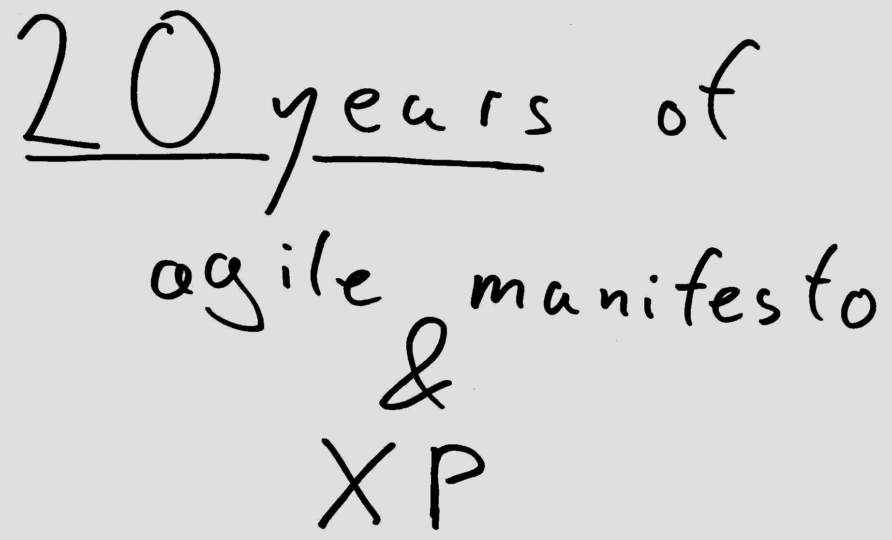
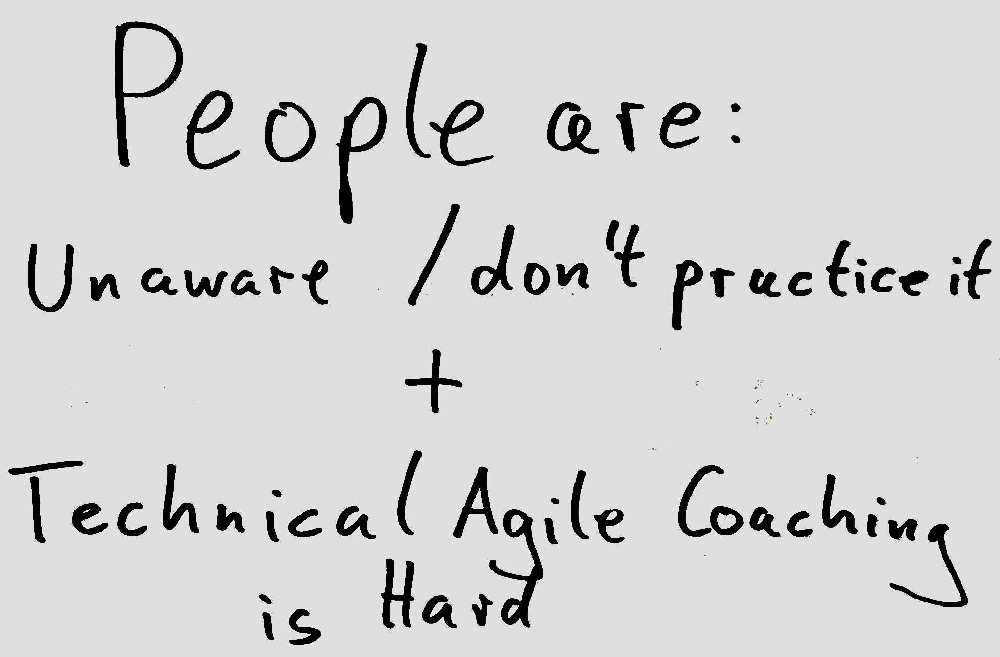
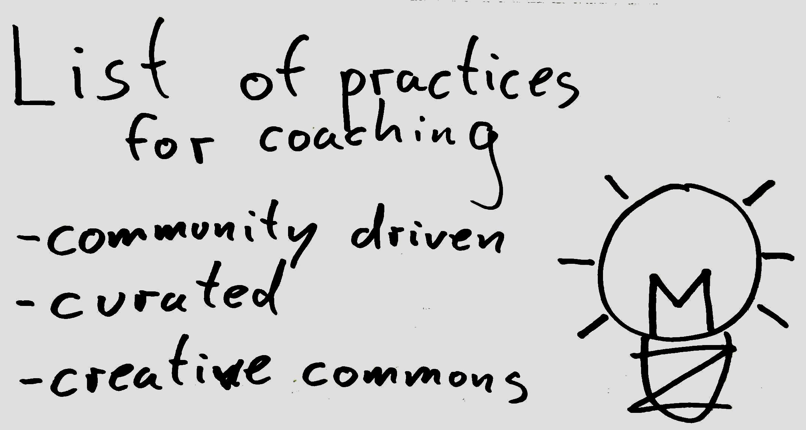
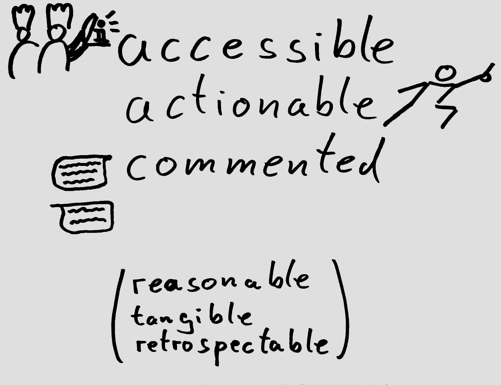
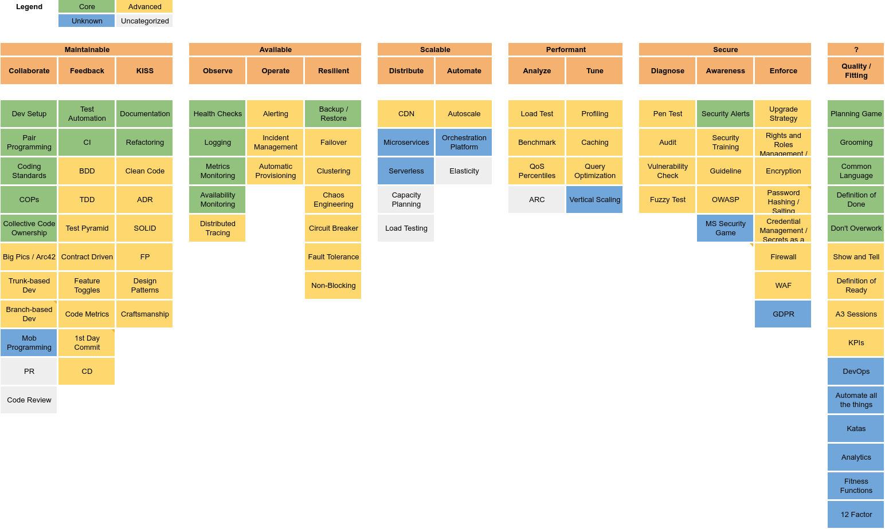
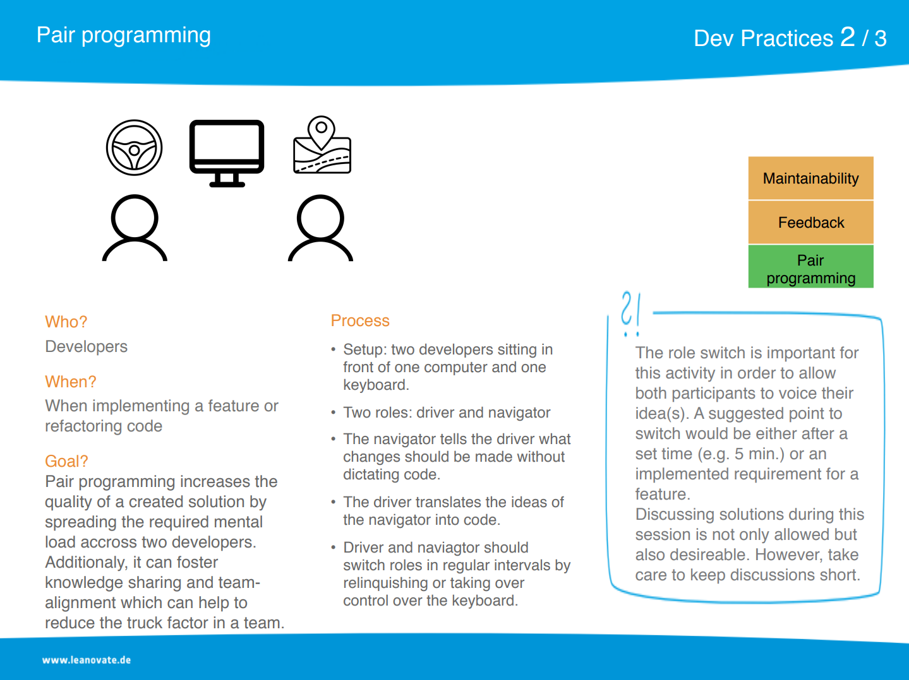

# Context

This slide deck was used to pitch the idea of a community currated ciriculum. 

# Slide 1

It has been nearly 20 years since the agile manifesto & XP was released into the wild.
Still we find that many practices described in them are rarely being used in companies we support.

# Slide 2

We are of the opinion that those practices can help tremendously to generate value for the customer and developers. 

Yet many companies, teams and developers struggle to adopt them even when being coached.
This generates a lot of unnecessary frustration.

We asked ourselves: why is this the case?

# Slide 3

From our experience people are either unaware of some (if not most) of those practices or they simply do not use them.

Whilst we know that there are many senior developers out there who could potentially teach those practices, we also know that they often lack the time, methodology and supporting learning material to do this in an effective manner.
Even for dedicated technical coaches it is hard to get the methodology part and supporting material right.

# Slide 4

This is why we propose the creation of an open-source, curated and community-driven list of practices.

It should be community driven in order to…
It should be curated so that…
It should be under a creative commons licence because it is a project by the community for the community

# Slide 5

This list should be accessible in the sense that it should be openly available online and easy to understand/follow. It should be actionable in the sense that for each practice it is immediately clear what needs to be done. It should be commented in the sense that users of this list can share their experience with a particular practice so that others may learn from them.

# Slide 6

This list above is a proof of concept which demonstrates one idea of how such a list could look like from a structural (sorted by level and category) and content point of view (the actual practices included in the list).

In a coaching context this list would be tailored towards the needs of the team.

# Slide 7

Each practice would be described further in knowledge cards which briefly describe what this practices tries to achieve, how the process works and some additional information.
Those cards might be used in a stand-alone context in order to quickly gain a very rough understanding of a practice. However, they are intended to be used in a coaching context.
The objective is to enable learners to make informed decisions about what to learn next.

# Slide 8

