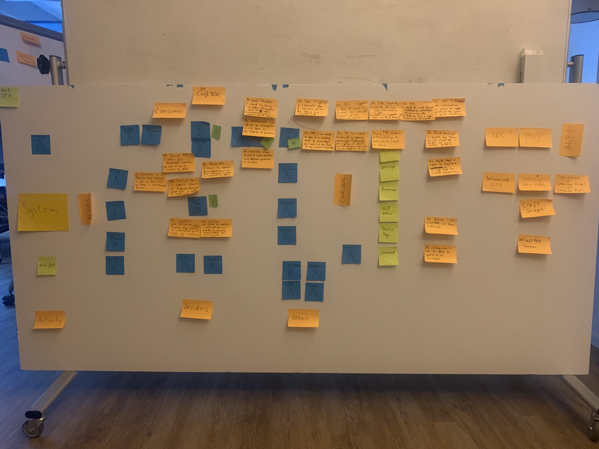

# Meeting from 06.08.2019
## Attendees
* York Xylander
* Ronald Brachetti
* (others, please add yourselves)

## Minutes
* Ron shared critical feedback he has recieved with respect to our project
 * We decided to remove all company names
 * We will have to reformulate some passages
 * We will add an FAQ section to clarify our intentions.
 * We must be more explicit about the license we will use for the content. CC BY-SA?    
* We had a discussion which stakeholders are most imported and ended up with
 * Technical Coach, Lead Developer, Developer, CopDev
* We continued the brainstorming

* Next Steps
 * York will type down all use-cases/stakeholders
 * Ron/Philipp are thinking of giving sessions about CraftBOK at socrates conference to gather more feedback  
