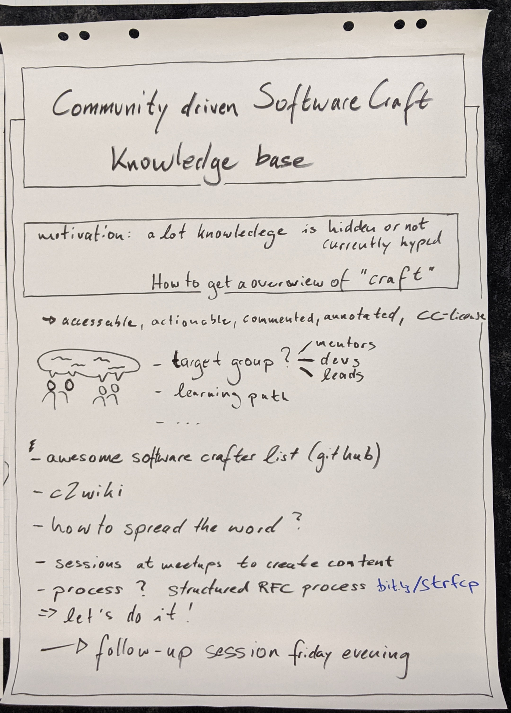
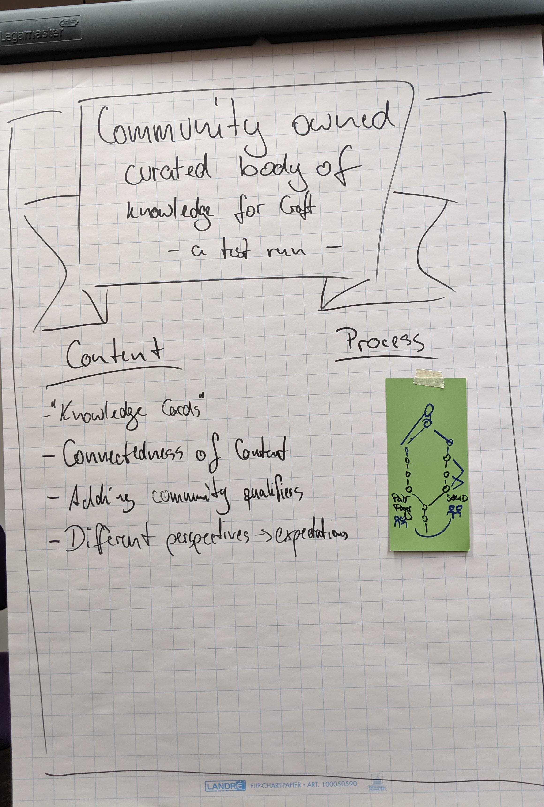
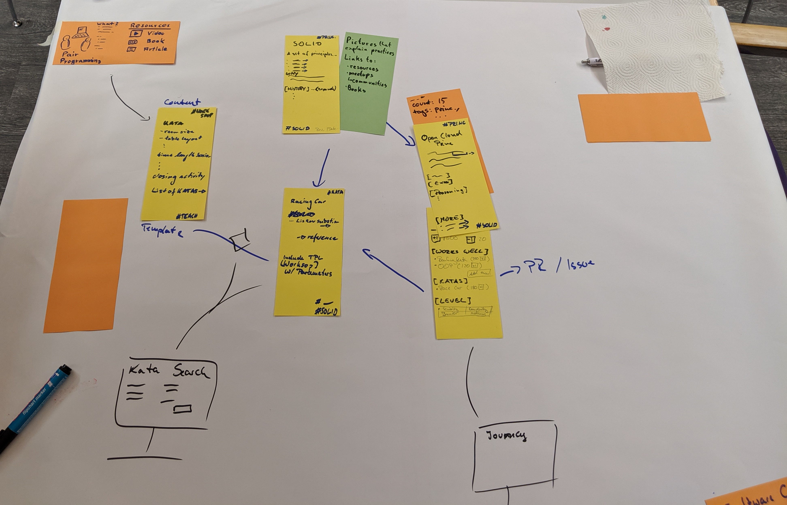

# Sessions (Friday)
## Day Session

presented the [idea](Community-curated-ciriculum-pitch.md) of why we care (have a need) to have a knowledge base for software craft practices.
and asked if this is what the group interests.
There was positive feedback in regards of usefulnes for devs and technical coaches.
This sparked the idea to do a more detailed session in the evening.

## Evening Session

paper prototype of how we see the knowledge base connected between content.
content we focused on was OCP from SOLID and pair programming and additional resources.
We decided to create some content to flesh out the prototype to be able to present it on Saturday evening.

