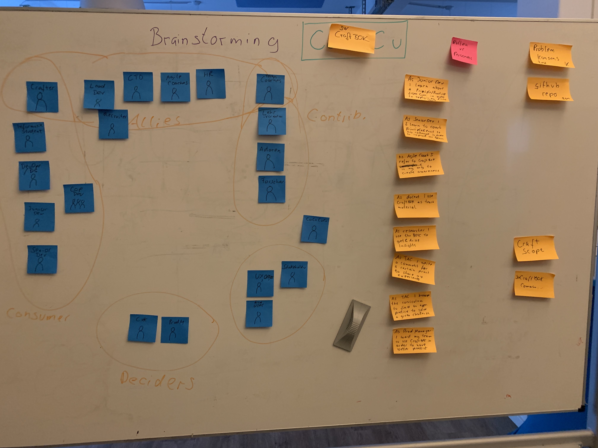

# Meeting from 30.07.2019
## Attendees
* York Xylander (leanovate)

## Minutes
* We walked through the pitch deck to have the same context
* We discussed and concluded that we are tackling the right problem(s)
* As first step of brainstorming we tried to identify "Roles"
 * We grouped these roles into types
  * Consumers
  * Contributors
  * Allies
  * Deciders
  * Misc
* We identified a few UserStories-like activities to find out what kind of activities could happen with a given curated curriculum.
* We concluded that we definately need another session :-)
 * York will invite for 06.08.2019
* Ron suggested as name "Craft BOK" and volunteered to create a github project in the socrates repo.

