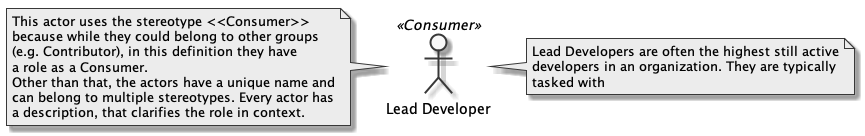
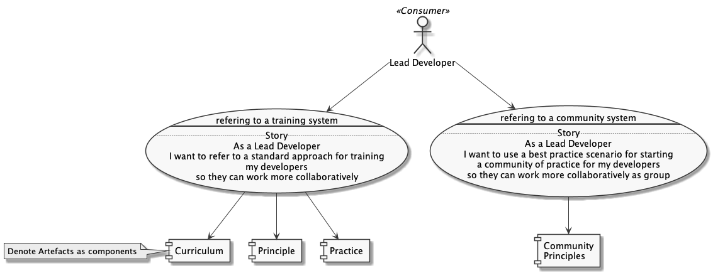

# Using the templates

## Types of Templates

Let's try to keep to Plant UML syntax, as it is widely tool supported.

In our creative process we talked about 

- Personas/Actors, 
- Use Cases, 
- Contexts, 
- Activities, and
- Artefacts.

For now we want to express our intent mostly in the form of 

- Actors, and
- Use Cases

## Usage

- Create files either as an actor, or as an use case
- Name the file accordingly with the file ending **.puml**
- Run `plantuml *.puml` in the directory
- Link it in the directory's **index.md**

## Examples

Example for an Actor

Example for an Use Case

